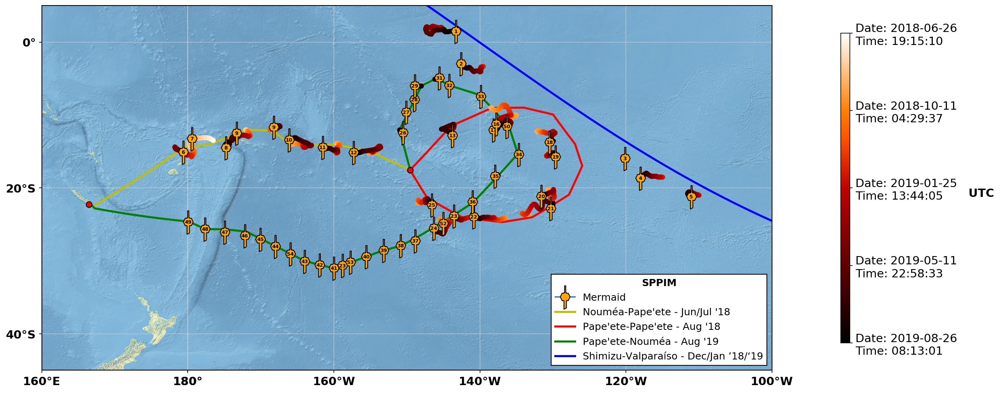

.. merplot documentation master file, created by
   sphinx-quickstart on Mon Sep  9 07:39:19 2019.
   You can adapt this file completely to your liking, but it should at least
   contain the root `toctree` directive.

merplot documentation!
===================================

Hi! This is the landing page for the merplot documentation. To find out about
what a Mermaid is, checkout out `earthscopeoceans.org <http://earthscopeoceans
.org>`_. `merplot` is a simple tool that plots maps (as seen above) or
animations of the Mermaid locations and trajectories using their so called
`.vit` vital files.
The Github repository for the mapping code is located `here <https://github
.com/lsawade/merplot>`_. The main dependencies as of now are matplotlib,
numpy, cartopy (for the maps), and ObsPy.

.. toctree::
   :maxdepth: 3
   :caption: Contents:

   installation
   tutorial
   filter
   modules

Indices and tables
==================

* :ref:`genindex`
* :ref:`modindex`
* :ref:`search`
